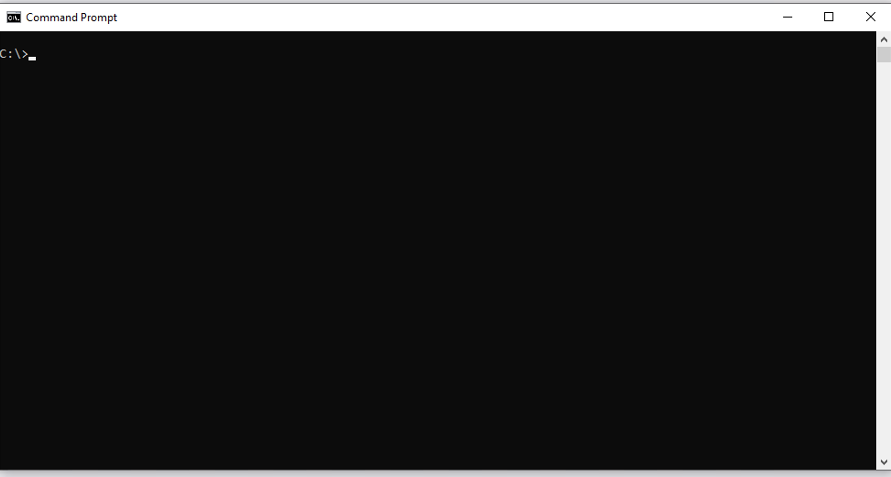
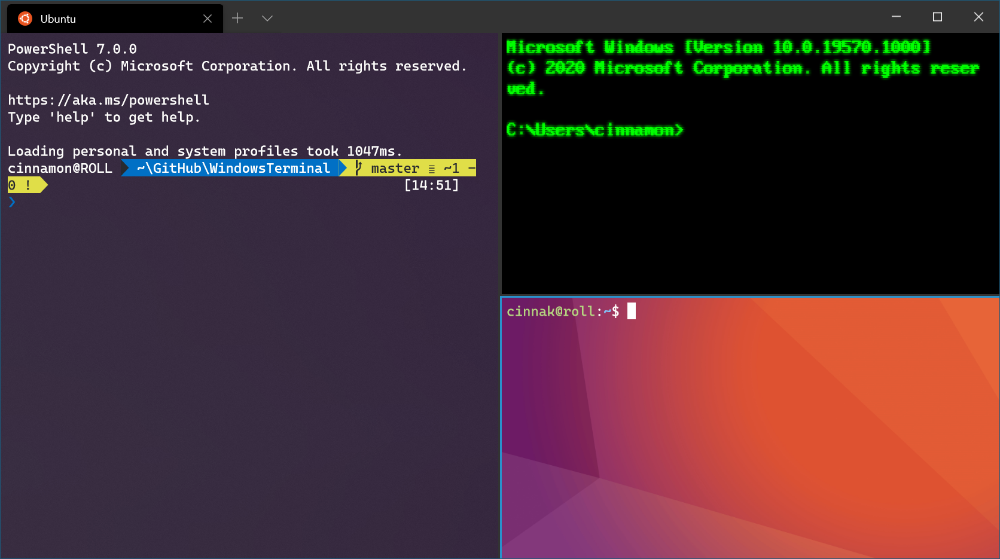
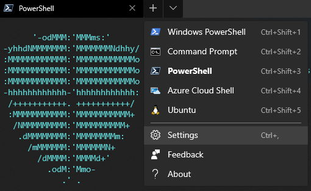
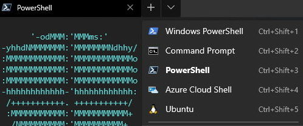
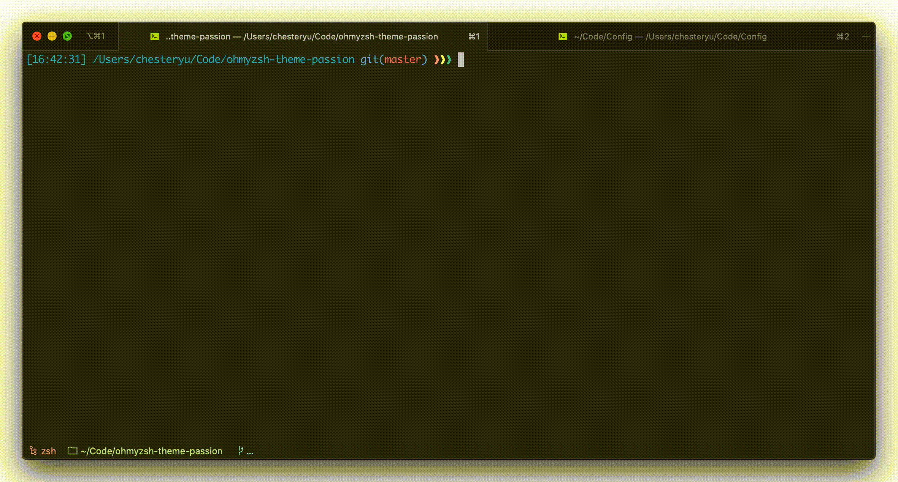

### Agenda : Go through the windows terminal, some configuration and integrations.

#
> Just a disclaimer: These are just my personal opinions :)

### History

#### Let's start with some history first
 - The first famous and well known shell was the first unix shell called Thompson sheel, sh. (Created in bell labs, you should know bell labs, please check out its history if you don't know currenly)
 - Then came the bourne (not Jason bourne :P, for the movie fans), we got the Bourne shell
- Enter the COMMAND.COM into the competition. This was the first shell written by a startup at that point which all of you should alredy be familiar with. (Microsoft).
- It was changed 7 years later to cmd.exe which is till date the default command line interpreter we use in windows.
- We had an update of borune shell called Bourne Again Shell (`BASH`), followed by yet another update on top of it `Zsh` (which I would be showing you).
- In 2006, we had a entry of big player for windows, the `PowerShell`.
- Now we come to 2020, and `Windows Terminal` enters the market.

#### Let's start with old commnad line first
- This has been the the old text based inteaction point for windows for long time now.
- Truthfully it is lagging in configurations and feautres when compared to where the world had moved in linux, mac (unix) env.
- Harder to customise and make it your own.

    
    
#

We can do much better. 

By combining the new Windows Terminal, WSL, and Oh-My-Zsh!

The new modern Windows Terminal gives us a nice tabbed interface, nearly limitless customization options, the ability to run shells across multiple operating systems in the same window, and the ability to split sessions into panes (ala [TMUX](https://github.com/tmux/tmux/wiki/Getting-Started)).

We spend so much time in our shells. Take a little time to personalize it and make it nice!

## Install Windows Subsystem for Linux (WSL)

Open a PowerShell prompt

Enable WSL

    Enable-WindowsOptionalFeature -Online -FeatureName Microsoft-Windows-Subsystem-Linux

Enable VirtualMachinePlatform to take advantage of latest WSL features

    Enable-WindowsOptionalFeature -Online -FeatureName VirtualMachinePlatform

Verify WSL version is 2 or greater

    wsl -l -v

Set WSL default version to latest

    wsl --set-default-version 2

If you already a Linux distribution installed, you can update the WSL version by running:

    wsl --set-version DistroName 2

## Install a Linux Distro

Common Linux distros are available in the Microsoft Store. In this example we will install Ubuntu 20.04 LTS.

[Install Ubuntu 20.04 LTS](https://www.microsoft.com/store/apps/9n6svws3rx71)

When the WSL launches for the first time with your new distro it will take some time to expand files and configure itself. Follow the prompts to create a username and password.

Verify your new distro is using WSL 2. This is very important, otherwise you will see significant performance reduction when performing any I/O operations.

    wsl --list --verbose

Update version as needed

    wsl --set-version DistroName 2

## Install Windows Terminal

[Install Windows Terminal](https://www.microsoft.com/en-us/p/windows-terminal/9n0dx20hk701)

## Customize Windows Terminal

One of the things that has always irked me about cmd.exe is the inability to add some pixel padding between console output and the edge of the window. Windows Terminal to the rescue!

Take some time to review all of the cool customizations you can make:

[Profile Settings](https://docs.microsoft.com/en-us/windows/terminal/customize-settings/profile-settings)

## Working with Panes

To start a new shell in its own tab:

Alternatively, you can start a shell in a new pane on the same tab by holding down the 'ALT' key while clicking the new shell.

For more info on working with panes:
https://docs.microsoft.com/en-us/windows/terminal/panes

## Configure shells

Now that we are getting comfortable with Windows Terminal, let's set up some more shells.

## Install oh-my-zsh

Install 'zsh' shell first if it's not already included in your distro:

    sudo apt install zsh

    exec zsh

The first time you run zsh you will be asked to configure it.
You can go with the default configuration for now.

Oh My Zsh is a delightful, open source, community-driven framework for managing your Zsh configuration. It comes bundled with thousands of helpful functions, helpers, plugins, themes, and a few things that make you shout...

"Oh My ZSH!"

Next, run the script below to install oh-my-zsh

    sh -c "$(curl -fsSL https://raw.github.com/ohmyzsh/ohmyzsh/master/tools/install.sh)"

## Pick a cool theme

Browse the themes available here:

    https://github.com/ohmyzsh/ohmyzsh/wiki/Themes

### Agnoster Theme

### Pygmalion Theme

### Passion Theme

Want even more themes?

    https://github.com/ohmyzsh/ohmyzsh/wiki/External-themes

To try one out, update the ZSH_THEME value in your zsh config:

    nano ~/.zshrc

Reload your profile

    . ~/.zshrc

#
## Add more integration and enjoy working with terminal

- oh-my-zsh (already covered above)
- fzf (https://github.com/junegunn/fzf)

- zsh-autosuggestions (https://github.com/zsh-users/zsh-autosuggestions)

- writing function which can be used to simplify your regular commands
EG: function gis {
    git status
}

